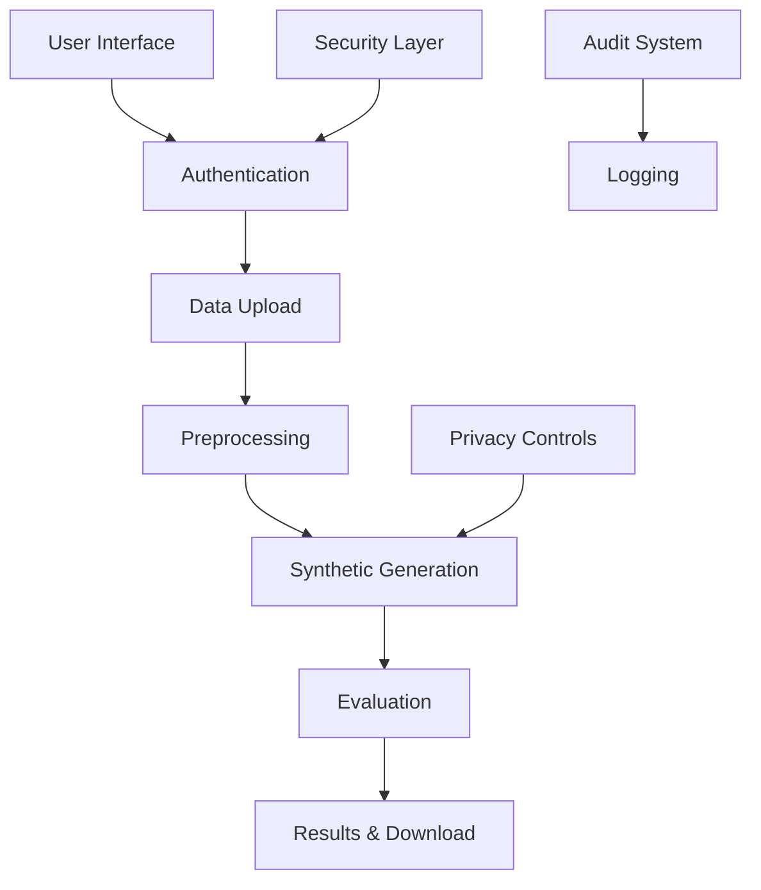

# MedSynX: Privacy-Preserving Synthetic Healthcare Data Generation Platform

## Overview
MedSynX is a state-of-the-art platform for generating synthetic healthcare data with strong privacy guarantees. It uses advanced Generative Adversarial Networks (GANs) with Differential Privacy (DP) to create high-quality synthetic data while preserving patient confidentiality.

## Key Features

### Data Generation
- Synthetic tabular data generation using DP-GANs
- Privacy-preserving data synthesis
- Support for various healthcare data formats
- Configurable privacy parameters (ε, δ)

### Privacy & Security
- Differential Privacy integration
- k-anonymity and l-diversity checks
- Membership inference attack protection
- Comprehensive security measures
- Detailed audit logging

### Evaluation & Metrics
- Statistical similarity measures
- Privacy preservation metrics
- Machine learning utility metrics
- Visual analytics and reporting
- Comprehensive evaluation dashboard

### User Interface
- Intuitive web interface
- Secure user authentication
- Data upload and preprocessing
- Privacy parameter configuration
- Results visualization and download

## Quick Start

### Prerequisites
```bash
# Clone the repository
git clone https://github.com/yourusername/medsynx.git
cd medsynx

# Create and activate virtual environment
python -m venv venv
source venv/bin/activate  # On Windows: venv\Scripts\activate

# Install dependencies
pip install -r requirements.txt
```

### Running with Docker
```bash
# Build and run with Docker Compose
docker-compose up --build
```

### Manual Setup
```bash
# Install development dependencies
pip install -r requirements-dev.txt

# Run the application
python run.py
```

## Usage Guide

1. **User Registration/Login**
   - Create an account or login at `/auth/register`
   - Secure authentication with JWT tokens

2. **Data Upload**
   - Support for CSV and Excel formats
   - Automatic data validation
   - Basic preprocessing options

3. **Synthetic Data Generation**
   - Configure privacy parameters
   - Select generation model
   - Monitor generation progress

4. **Evaluation & Download**
   - View comprehensive metrics
   - Analyze data quality
   - Download synthetic dataset

## Privacy Controls

### Differential Privacy Parameters
- Epsilon (ε): Controls privacy budget
- Delta (δ): Privacy relaxation parameter
- Minimum dataset size requirements

### Security Measures
- Rate limiting
- Input validation
- Secure file handling
- Audit logging
- Access controls

## Evaluation Metrics

### Utility Metrics
- Statistical similarity
- Distribution comparison
- ML model performance

### Privacy Metrics
- Membership inference risk
- Attribute disclosure risk
- k-anonymity estimation
- l-diversity measures

## Architecture



## API Documentation

### Authentication
```
POST /api/v1/auth/register
POST /api/v1/auth/login
```

### Data Management
```
POST /api/v1/upload
GET /api/v1/datasets
```

### Synthetic Generation
```
POST /api/v1/generate
GET /api/v1/jobs/{job_id}
```

### Evaluation
```
GET /api/v1/evaluate/{dataset_id}
GET /api/v1/metrics/{job_id}
```

## Development

### Testing
```bash
# Run tests
pytest

# Run with coverage
pytest --cov=app tests/
```

### Code Quality
```bash
# Run linters
flake8 app/
black app/
```

## Security Considerations

- All uploads are validated and sanitized
- File size and type restrictions
- Rate limiting per IP
- Secure password policies
- Regular security audits

## Future Roadmap

### Phase 2 (Medical Imaging)
- Support for DICOM and NIFTI formats
- Image-specific GANs
- Advanced visualization tools

### Phase 3 (Enhanced Features)
- Additional privacy metrics
- Advanced visualization options
- API expansion
- Performance optimization

## Contributing

Please read [CONTRIBUTING.md](CONTRIBUTING.md) for details on our code of conduct and the process for submitting pull requests.

## License

This project is licensed under the MIT License - see the [LICENSE](LICENSE) file for details.

## Acknowledgments

- SynthCity library for synthetic data generation
- FastAPI for the backend framework
- Streamlit for the frontend interface 