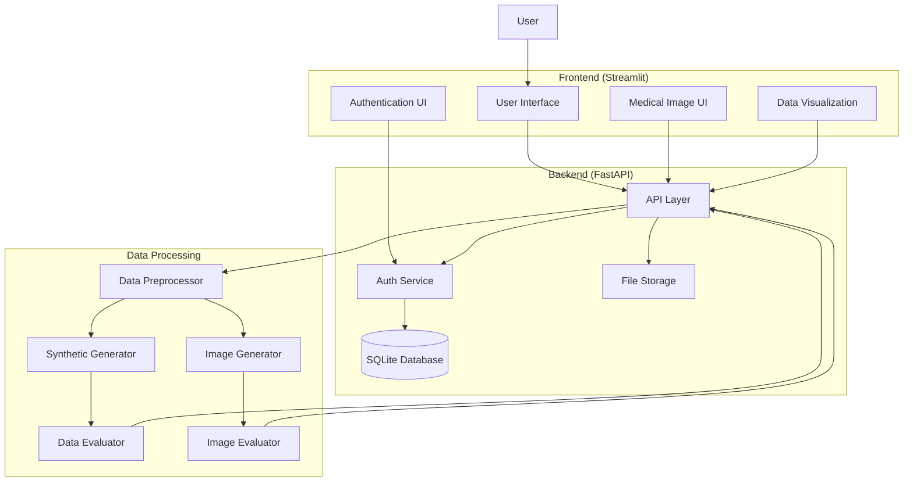

# MedSynX Architecture

## System Overview

MedSynX is built with a microservices architecture that separates the frontend, backend, and data processing components. The system uses FastAPI for the backend API, Streamlit for the frontend, and integrates multiple synthetic data generation engines including Synthcity for tabular data and custom GANs for medical imaging.

## Architecture Diagram

## Component Description

### Frontend Layer
- **User Interface**: Streamlit-based web interface
- **Authentication UI**: User registration and login
- **Data Visualization**: Interactive data plots and metrics display
- **Medical Image UI**: Specialized interface for medical image processing

### Backend Layer
- **API Layer**: FastAPI endpoints for data handling
- **Auth Service**: JWT-based authentication
- **Database**: SQLite for user and dataset management
- **File Storage**: Local storage for uploaded files

### Data Processing Layer
- **Data Preprocessor**: Data validation and preparation
- **Synthetic Generator**: Synthcity-based data generation
- **Image Generator**: GAN-based medical image synthesis
- **Data Evaluator**: Quality and privacy metrics calculation
- **Image Evaluator**: Specialized metrics for medical images

## Data Flow

1. User Authentication:
   - User registers/logs in through frontend
   - Backend validates credentials
   - JWT token issued for session

2. Data Upload:
   a. Tabular Data:
      - User uploads dataset
      - Backend validates and stores file
      - Data preprocessor prepares data
      - Summary statistics generated

   b. Medical Images:
      - User uploads DICOM/NIfTI/standard images
      - Image processor validates and extracts metadata
      - Images preprocessed for model input
      - Metadata stored in database

3. Synthetic Data Generation:
   a. Tabular Data:
      - User selects parameters
      - Data passed to synthetic generator
      - Privacy controls applied
      - Results evaluated
      - Synthetic data stored

   b. Medical Images:
      - User sets generation parameters
      - GAN model generates synthetic images
      - Differential privacy noise added
      - Images evaluated and stored
      - Results displayed to user

4. Results Retrieval:
   a. Tabular Data:
      - Metrics calculated
      - Visualizations generated
      - Data available for download

   b. Medical Images:
      - Quality metrics computed
      - Privacy metrics assessed
      - Visual comparisons generated
      - Reports and images available for download

## Security Measures

1. Authentication:
   - JWT-based token system
   - Password hashing with bcrypt
   - Session management

2. Data Protection:
   - Differential privacy controls
   - Secure file storage
   - Access control
   - Medical image anonymization

3. API Security:
   - CORS protection
   - Rate limiting
   - Input validation
   - File type verification

## Privacy Controls

1. Tabular Data:
   - Differential privacy implementation
   - Membership inference protection
   - Attribute privacy preservation

2. Medical Images:
   - Differential privacy noise addition
   - Metadata scrubbing
   - Privacy-preserving GANs
   - Robust evaluation metrics

## Scalability Considerations

1. Storage:
   - File system abstraction
   - Database indexing
   - Caching layer (future)
   - Image compression and optimization

2. Processing:
   - Async task processing
   - Batch operations
   - Resource monitoring
   - GPU acceleration for image generation

3. Deployment:
   - Docker containerization
   - Environment configuration
   - Volume management
   - Model versioning 