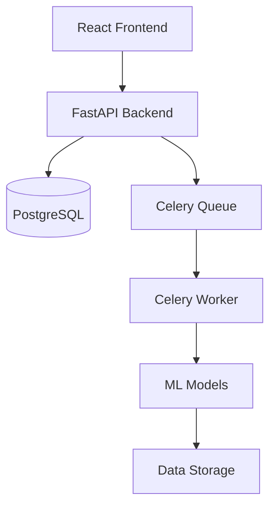

# Medsynx Developer Guide

## Table of Contents
1. [Architecture Overview](#architecture-overview)
2. [Setup and Installation](#setup-and-installation)
3. [Backend Development](#backend-development)
4. [Frontend Development](#frontend-development)
5. [Testing](#testing)
6. [Deployment](#deployment)
7. [Contributing](#contributing)

## Architecture Overview

### System Components


### Key Technologies
- Backend: FastAPI, Python 3.8+
- Frontend: React, TypeScript
- Database: PostgreSQL
- Queue: Celery with Redis
- ML Framework: SynthCity, PyTorch
- Testing: Pytest, Jest, Cypress

## Setup and Installation

### Prerequisites
- Python 3.8+
- Node.js 14+
- PostgreSQL 12+
- Redis
- Docker and Docker Compose

### Local Development Setup
1. Clone the repository:
   ```bash
   git clone https://github.com/your-org/medsynx.git
   cd medsynx
   ```

2. Backend setup:
   ```bash
   python -m venv venv
   source venv/bin/activate  # or `venv\Scripts\activate` on Windows
   pip install -r requirements.txt
   ```

3. Frontend setup:
   ```bash
   cd frontend
   npm install
   ```

4. Environment configuration:
   ```bash
   cp .env.example .env
   # Edit .env with your local settings
   ```

5. Database setup:
   ```bash
   python scripts/init_db.py
   ```

## Backend Development

### Project Structure
```
app/
├── api/
│   ├── endpoints/
│   ├── dependencies.py
│   └── router.py
├── core/
│   ├── config.py
│   └── security.py
├── db/
│   ├── models.py
│   └── session.py
├── services/
│   ├── data_processor.py
│   └── synthetic_generator.py
└── main.py
```

### Adding New Endpoints
1. Create endpoint module in `app/api/endpoints/`
2. Define route operations using FastAPI decorators
3. Add route to `app/api/router.py`
4. Update OpenAPI documentation

Example:
```python
from fastapi import APIRouter, Depends
from app.core.security import get_current_user

router = APIRouter()

@router.post("/data/{job_id}/analyze")
async def analyze_data(
    job_id: str,
    current_user = Depends(get_current_user)
):
    # Implementation
    pass
```

### Database Operations
1. Define models in `app/db/models.py`
2. Use SQLAlchemy for queries
3. Follow migration practices

Example:
```python
from sqlalchemy import Column, Integer, String
from app.db.base import Base

class User(Base):
    __tablename__ = "users"
    id = Column(Integer, primary_key=True)
    email = Column(String, unique=True)
```

## Frontend Development

### Project Structure
```
frontend/
├── src/
│   ├── components/
│   ├── context/
│   ├── hooks/
│   ├── pages/
│   ├── services/
│   └── utils/
├── public/
└── package.json
```

### Component Development
1. Create components in `src/components/`
2. Use TypeScript for type safety
3. Follow React best practices

Example:
```typescript
import React from 'react';
import { useAuth } from '../context/AuthContext';

interface Props {
  onSuccess: () => void;
}

export const DataUpload: React.FC<Props> = ({ onSuccess }) => {
  const { user } = useAuth();
  // Implementation
};
```

### State Management
1. Use React Context for global state
2. Custom hooks for reusable logic
3. Local state for component-specific data

Example:
```typescript
import { createContext, useContext, useState } from 'react';

const DataContext = createContext<DataContextType | null>(null);

export const DataProvider: React.FC = ({ children }) => {
  const [data, setData] = useState<Data[]>([]);
  // Implementation
};
```

## Testing

### Backend Testing
1. Unit tests with pytest
2. Integration tests for API
3. Run tests:
   ```bash
   pytest tests/
   ```

### Frontend Testing
1. Component tests with Jest
2. E2E tests with Cypress
3. Run tests:
   ```bash
   # Unit tests
   npm test
   
   # E2E tests
   npm run cypress:open
   ```

### Test Coverage
- Maintain 80%+ coverage
- Run coverage reports:
  ```bash
  pytest --cov=app tests/
  npm run test:coverage
  ```

## Deployment

### Docker Deployment
1. Build images:
   ```bash
   docker-compose build
   ```

2. Run services:
   ```bash
   docker-compose up -d
   ```

### Environment Variables
Required variables:
- `DATABASE_URL`
- `SECRET_KEY`
- `REDIS_URL`
- `MODEL_STORAGE_PATH`

### Monitoring
1. Application metrics with Prometheus
2. Log aggregation with ELK Stack
3. Error tracking with Sentry

## Contributing

### Development Workflow
1. Create feature branch
2. Write tests
3. Implement changes
4. Submit PR

### Code Style
- Python: Black formatter
- TypeScript: ESLint + Prettier
- Pre-commit hooks for consistency

### Documentation
1. Update API documentation
2. Add JSDoc comments
3. Update README if needed

### Review Process
1. Code review required
2. Tests must pass
3. Documentation updated
4. No linting errors 